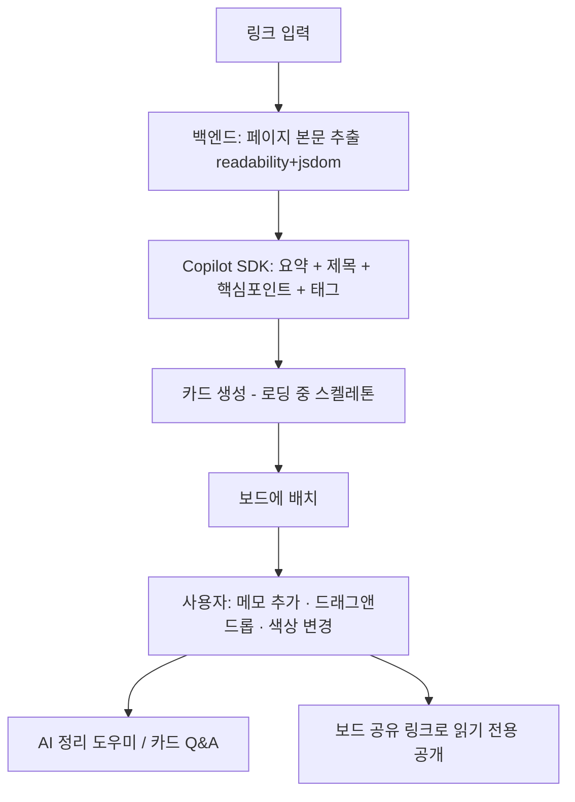
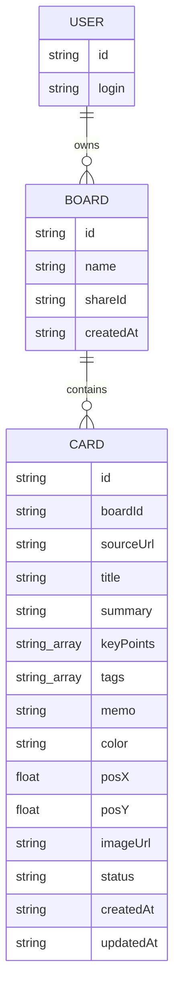
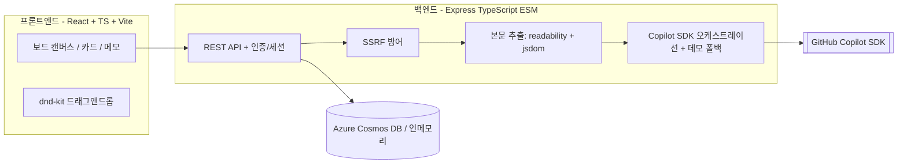

# Curio — 제품 요구사항 문서 (PRD)

> **AI 웹 큐레이션 보드** — 흩어진 웹 정보를 GitHub Copilot SDK가 요약한 **카드**로 만들어 비주얼 **보드**에 큐레이션하는 개인 생산성 웹 앱.

| 항목 | 내용 |
|------|------|
| **제품명** | Curio |
| **한 줄 소개** | "읽은 것을 버리지 않고, 나만의 지식으로 만든다." |
| **라이브 데모** | **https://app-curio-osnoy7.azurewebsites.net** |
| **상태** | 🟢 LIVE · Azure 배포 완료 (`copilotMode=live`, `authMode=live`) |
| **저장소** | https://github.com/SmileJune/lipcoding |
| **문서** | 설계: [PROJECT.md](PROJECT.md) · 사용법: [README.md](README.md) · 결정 로그: [LOG.md](LOG.md) · API: [api/openapi.yaml](api/openapi.yaml) |

---

## 1. 제품 개요 & 비전

Curio는 링크 하나를 붙여넣으면 GitHub Copilot SDK가 페이지 본문을 분석해 **제목·1줄 요약·핵심 포인트·추천 태그**를 갖춘 카드로 만들어 주는 웹 앱입니다. 사용자는 카드에 메모를 더하고 드래그앤드롭으로 자유롭게 배치하며 자기만의 큐레이션 보드를 완성합니다.

**비전**: 정보를 "저장만 하고 다시 안 보는" 북마크의 근본 문제를 해결한다. 주소가 아니라 *요약과 내 생각*을 저장해, 다시 열어보지 않아도 기억나게 만든다.

---

## 2. 문제 정의 & 목표

| 구분 | 내용 |
|------|------|
| **문제** | 매일 수많은 웹페이지·아티클을 읽지만 나중에 다시 찾거나 정리하기 어렵다. 북마크는 쌓이기만 하고 죽은 링크가 된다. |
| **기존 한계** | 북마크는 요약이 없어 페이지를 다시 열어야 하고, 노트 앱은 직접 옮겨 적어야 한다. |
| **해결** | 링크 한 번 → **AI가 핵심을 요약한 카드** 생성 → 시각적 보드에서 **드래그앤드롭**으로 정리 → 메모로 내 생각 덧붙이기. |

**제품 목표**
1. 링크 입력에서 요약 카드 생성까지 **수 초 내** 완료 (로딩 중 스켈레톤으로 즉시 피드백).
2. AI 요약·정리·질의응답을 **하나의 워크플로**로 묶어 능동적 정리를 유도.
3. 토큰·외부 의존성 미설정 상태에서도 **항상 동작**하도록 데모 폴백 보장.
4. `azd up` 한 번으로 재현 가능한 Azure 배포.

---

## 3. 타겟 사용자 & 사용 시나리오

**대상**: 리서치하는 학생·직장인, 콘텐츠 기획자, 개발자 등 정보 수집이 많은 누구나.

**대표 시나리오**
1. 아티클을 읽다가 링크를 Curio에 붙여넣는다 → 수 초 만에 요약 카드 생성.
2. 카드를 주제별 보드(예: "이번 발표 자료", "공부할 것")로 드래그.
3. 카드에 "이 부분 인용하기" 같은 메모를 남긴다.
4. 나중에 보드를 열어 요약·메모만 훑어보며 빠르게 회상한다.
5. "이 카드들 어떻게 분류할까?" → AI 정리 도우미가 그룹핑을 제안.
6. 완성한 보드를 공유 링크로 읽기 전용 공개.

---

## 4. 핵심 가치 제안 & 차별점

> **"북마크가 못 하는 건 저장한 걸 다시 안 본다는 것 — Curio는 안 열어봐도 기억나게 만든다."**

| 항목 | 기존 북마크 | Curio |
|------|-------------|-------|
| 저장되는 것 | 링크(주소)만 | 링크 + **AI 요약·핵심 포인트** |
| 다시 볼 때 | 페이지를 다시 열어야 함 | **카드만 봐도** 내용 회상 |
| 정리 방식 | 폴더 트리(계층) | **자유 배치 보드**(드래그앤드롭) |
| 내 생각 | 못 남김 | 카드마다 **메모 추가** |
| 페이지가 사라지면 | 정보 소실(죽은 링크) | 요약이 남아 **가치 보존** |
| 분류 | 수동 | **AI 태그·그룹핑·Q&A** |

**진짜 차별점 3가지**
1. **"포인터"가 아니라 "지식"** — 주소가 아닌 *요약 + 내 메모*를 저장해 다시 열 필요가 없다.
2. **읽기 → 생각 → 연결이 한 흐름** — 저장에서 끝나지 않고 요약 확인 → 메모 → AI 그룹핑까지 이어진다.
3. **공간적·시각적 큐레이션** — 폴더가 아닌 캔버스. 카드를 펼쳐 배치하며 생각이 정리된다.

---

## 5. 핵심 기능 요구사항

> 상태: ✅ 구현·배포 완료 (라이브에서 동작 검증됨)

| # | 기능 | 설명 | Copilot SDK | 상태 |
|---|------|------|:----------:|:----:|
| F1 | **링크 → 카드 생성** | URL 입력 시 페이지 본문 추출 후 요약 카드 생성 | ✅ | ✅ |
| F2 | **AI 요약 카드** | 제목·1줄 요약·핵심 포인트 3~5개·추천 태그 자동 생성 | ✅ | ✅ |
| F3 | **대표 이미지** | 페이지 `og:image`/`twitter:image` 썸네일 자동 표시(`no-referrer`로 hotlink 차단 회피) | — | ✅ |
| F4 | **비주얼 보드** | `@dnd-kit` 드래그앤드롭 자유 배치, 카드 색상 변경 | — | ✅ |
| F5 | **메모** | 각 카드에 자유 메모 추가 | — | ✅ |
| F6 | **태그 / 필터** | AI 태그 + 사용자 태그 기반 분류 | ✅ | ✅ |
| F7 | **보드 관리** | 여러 보드 생성·전환(주제별) | — | ✅ |
| F8 | **AI 정리 도우미** | "이 카드들 어떻게 분류할까?" → 그룹핑·라벨 제안 | ✅ | ✅ |
| F9 | **카드 Q&A** | 특정 카드/보드 내용에 대해 자연어 질의응답 | ✅ | ✅ |
| F10 | **보드 공유** | 공유 링크(`/api/shared/:shareId`)로 보드를 읽기 전용 공개 | — | ✅ |
| F11 | **로딩 UX** | 카드 생성 중 스켈레톤 자리표시(점선·스피너·shimmer, `prefers-reduced-motion` 대응) | — | ✅ |
| F12 | **GitHub 로그인** | GitHub OAuth 인증 + JWT 세션, 토큰 미설정 시 데모 모드 | — | ✅ |

---

## 6. 사용자 흐름



---

## 7. UI / 화면 구성

```
┌──────────────────────────────────────────────────────────┐
│  Curio   [ 링크 붙여넣기 ____________ ] [+ 카드]  [공유][로그인]│
├───────────┬──────────────────────────────────────────────┤
│ 보드 목록  │   보드 캔버스 (드래그앤드롭 영역)              │
│ • 전체     │   ┌─────────┐  ┌─────────┐                  │
│ • 발표자료 │   │ 카드 A   │  │ 카드 B   │                  │
│ • 공부     │   │ 요약…    │  │ 요약…    │                  │
│ [AI 도우미]│   │ #태그    │  │ 메모📝   │                  │
└───────────┴──────────────────────────────────────────────┘
```

- **상단 바**: 링크 입력 → 즉시 카드 생성, 보드 공유, 로그인.
- **좌측 사이드바**: 보드 전환, AI 정리 도우미 패널 토글.
- **메인 캔버스**: 카드 드래그앤드롭, 카드 상세(요약·핵심포인트·메모·원문 링크·색상).

---

## 8. 데이터 모델



- **Card**: AI가 채우는 필드(`title`·`summary`·`keyPoints`·`tags`)와 사용자가 채우는 필드(`memo`·`color`·위치)를 분리.
- **`status`**: `ready` · `summarizing` · `error` — 로딩 스켈레톤 표시에 사용.
- **`imageUrl`**: 페이지 대표 이미지(`og:image`→`twitter:image`→`image_src`), 없으면 `null`.
- **Board.`shareId`**: 공유 링크용 토큰(nullable). 설정 시 공개 읽기 전용 조회 가능.
- **데이터 격리**: 사용자별로 보드·카드를 분리 저장(`ensureUserSeed`).
- MVP는 **인메모리 스토어**, 프로덕션은 **Azure Cosmos DB**로 자동 전환(`COSMOS_ENDPOINT` 설정 시).

---

## 9. 시스템 아키텍처



> 단일 Azure App Service(Linux)에서 Express가 빌드된 React SPA(`api/public`)와 `/api`를 함께 서빙합니다.

---

## 10. GitHub Copilot SDK 활용

AI 기능은 **GitHub Copilot SDK**로 구현하며, 토큰·provider 미설정 또는 호출 실패 시 **데모 폴백**으로 앱이 항상 동작합니다(심사 환경 안정성 보장).

| 사용처 | 역할(시스템 프롬프트) | 출력 |
|--------|----------------------|------|
| **페이지 요약** (F2) | "본문을 요약·핵심정리하는 큐레이터" | `{ title, summary, keyPoints[], tags[] }` |
| **정리 도우미** (F8) | "카드들을 주제별로 묶는 정리 전문가" | 그룹·라벨 제안 |
| **카드 Q&A** (F9) | "보드 내용 기반 어시스턴트 'Curio'" | 자연어 답변 |

**설계 원칙**
- **Provider 추상화**: Azure OpenAI/Foundry(BYOM, 관리 ID 베어러 토큰) → GitHub Copilot 기본 → 데모 폴백 순으로 자동 선택.
- **항상 동작**: 어떤 경로든 실패하면 데모 응답으로 폴백해 라이브 핵심 흐름(working-gate)을 보호.
- **테스트 가능성**: 실행기(runner)를 의존성 주입으로 모킹해 외부 호출 없이 검증.

---

## 11. Azure 클라우드 통합

`azd`로 한 번에 프로비저닝·배포합니다. 인프라는 **Bicep IaC**로 완전 코드화되어 있습니다.

| 리소스 | 용도 |
|--------|------|
| **App Service (Linux, Node 20)** | Express가 React SPA + `/api` 서빙 (`node dist/server.js`) |
| **Cosmos DB (serverless)** | 카드·보드 영구 저장, 컨테이너 `cards`/`boards` |
| **Application Insights / Log Analytics** | 텔레메트리·관측성 |
| **Managed Identity + RBAC** | Cosmos를 **키 없이**(키리스) 관리 ID 기반 RBAC로 접근 |

- **IaC**: [infra/main.bicep](infra/main.bicep) + [infra/modules/resources.bicep](infra/modules/resources.bicep), 배포 설정 [azure.yaml](azure.yaml).
- **재현성**: `azd up` 한 번으로 프로비저닝 + 빌드(web→`api/public`) + 배포.
- **런타임 인증**: 프로덕션에서 `ManagedIdentityCredential`/`DefaultAzureCredential`로 비밀 없이 자격 획득.

---

## 12. 보안 & Responsible AI

- **SSRF 방어**: 외부 URL fetch 시 사설 IP 대역 차단, 본문 크기 제한([api/src/ssrf.ts](api/src/ssrf.ts)).
- **시크릿 관리**: 비밀값은 `.env`(gitignore) / 환경변수 / Azure로만 관리하고 코드·커밋에 포함하지 않음. 템플릿은 `.env.example`.
- **키리스 데이터 접근**: Cosmos DB는 액세스 키 대신 관리 ID 기반 RBAC 사용.
- **인증·세션**: GitHub OAuth + `jose` JWT 세션 쿠키(`sameSite=lax`), 변경 요청은 동일 출처만 허용(CSRF 완화).
- **사용자 데이터 분리**: 보드·카드를 사용자별로 격리.
- **AI 투명성**: AI가 생성한 필드와 사용자가 작성한 필드를 데이터 모델에서 분리. 실패 시 데모 폴백으로 graceful degradation.
- **OWASP Top 10** 준수 지향.

---

## 13. 기술 스택

| 구분 | 기술 |
|------|------|
| 프론트엔드 | React + TypeScript + Vite, `@dnd-kit` |
| 백엔드 | Node.js + Express (TypeScript ESM) |
| 본문 추출 | `@mozilla/readability` + `jsdom` |
| AI | GitHub Copilot SDK + 데모 폴백 |
| 데이터 | 인메모리(개발) → Azure Cosmos DB(프로덕션, 키리스 RBAC) |
| 인증 | GitHub OAuth (`jose` JWT 세션) + 데모 폴백 |
| 인프라 | Azure App Service(Linux) + Cosmos DB, Bicep IaC, `azd` |
| 테스트 | Vitest(단위·통합) + Playwright(E2E) |

---

## 14. API 명세 (요약)

| 메서드 | 경로 | 설명 |
|--------|------|------|
| `POST` | `/api/cards/from-url` | URL → 본문 추출 + AI 요약 → 카드 생성 |
| `GET` | `/api/cards?boardId=` | 카드 목록 조회 |
| `PATCH` | `/api/cards/:id` | 메모·위치·색상·태그 수정 |
| `DELETE` | `/api/cards/:id` | 카드 삭제 |
| `GET` / `POST` | `/api/boards` | 보드 목록 조회 / 생성 |
| `POST` | `/api/boards/:id/organize` | AI 정리 도우미(그룹핑 제안) |
| `POST` / `DELETE` | `/api/boards/:id/share` | 보드 공유 링크 생성 / 해제 |
| `GET` | `/api/shared/:shareId` | 공유 보드 읽기 전용 조회(공개) |
| `POST` | `/api/chat` | 카드/보드 기반 Q&A |
| `GET` | `/api/auth/me` · `/api/auth/login` · `/api/auth/callback` | GitHub OAuth 인증 |
| `GET` | `/api/health` | 상태 + Copilot/인증/스토어 모드 |

> 전체 명세: [api/openapi.yaml](api/openapi.yaml) (redocly 린트 통과).

---

## 15. 비기능 요구사항

| 항목 | 요구사항 |
|------|----------|
| **성능** | 링크 → 카드 생성 수 초 내, 로딩 중 즉시 스켈레톤 피드백 |
| **신뢰성** | AI/외부 호출 실패 시 데모 폴백으로 핵심 흐름 무중단 |
| **가용성** | App Service `alwaysOn`으로 콜드스타트 완화 |
| **접근성** | 스켈레톤 `role=status`/`aria-busy`, `prefers-reduced-motion` 대응 |
| **유지보수성** | TypeScript strict, 모듈 분리(`app`/`service`/`ai`/`extract`/`ssrf`/`auth`/`store`) |
| **이식성** | 스토어 인터페이스로 인메모리↔Cosmos 무변경 전환 |

---

## 16. 테스트 & 품질 보증

- **백엔드**: Vitest 단위·통합 테스트 (`api/test/` — ai·app·auth·extract·service·ssrf·store).
- **프론트엔드**: Vitest + Testing Library (`web/test/` — App·CardItem·CardSkeleton·dnd·LinkInput·SharedBoard·api).
- **외부 호출 모킹**: Copilot·URL fetch를 모킹하고 **데모 폴백 경로도 함께 검증**.
- **타입·린트**: `tsc` strict 통과, OpenAPI `redocly lint` 통과.
- **실행 명령**: `cd api && npm test`, `cd web && npm test`.
- **완료 기준**: 테스트 작성 + 실제 실행 통과를 확인한 뒤에만 기능 완료로 간주.

---

## 17. 배포 & 운영 상태

| 항목 | 상태 |
|------|------|
| 라이브 URL | 🟢 https://app-curio-osnoy7.azurewebsites.net |
| Health | `{"status":"ok","copilotMode":"live","authMode":"live"}` |
| Copilot | 🟢 live (토큰 미설정 시 데모 폴백) |
| 인증 | 🟢 GitHub OAuth 라이브 로그인 |
| 데이터 | 🟢 Cosmos DB serverless (키리스 RBAC) |
| 배포 방식 | `azd up` (Bicep IaC, 프론트 빌드→`api/public`, `node dist/server.js` 기동) |

---

## 18. 향후 로드맵

| 단계 | 산출물 |
|------|--------|
| 크롬 확장 | 현재 페이지를 클릭 한 번으로 카드화 (드래그한 텍스트 포함) |
| 지식 그래프 | 카드 간 연관성 자동 연결 |
| 협업 | 공유 보드 실시간 협업·코멘트 |
| 할 일 연동 | 카드를 "읽을 것/할 일"로 전환 |
| 접근성 | 음성 입력으로 메모 추가 |

---

## 19. 평가 루브릭 대응

| 심사 항목 | Curio의 대응 |
|-----------|--------------|
| **Copilot SDK 활용** | 요약·정리·Q&A 3종 AI 기능을 Copilot SDK로 구현, provider 추상화 + 데모 폴백 |
| **생산성 임팩트 & 문제 적합성** | "북마크의 죽음" 해결 — 누구나 매일 겪는 정보 정리 문제를 정조준 |
| **Azure AI & 클라우드 통합** | App Service + Cosmos DB(키리스) + App Insights, 완전 Bicep IaC, `azd up` 재현 |
| **기능성 & 기술 완성도** | 링크→카드→보드→공유 전 흐름 라이브 동작, 백엔드/프론트 테스트 통과 |
| **UX & 워크플로 설계** | 드래그앤드롭 비주얼 보드, 로딩 스켈레톤, 수 초 카드 생성 |
| **Responsible AI · 보안 · 신뢰** | SSRF 방어, 키리스 RBAC, OAuth 세션, 사용자 데이터 분리, AI/사용자 필드 분리, 데모 폴백 |
| **혁신성 & 독창성** | 클리퍼 + AI 요약 + 자유 캔버스를 하나의 흐름으로 결합 |

---

> 본 문서는 Curio의 제품 요구사항 기준 문서(PRD)입니다. 상세 설계는 [PROJECT.md](PROJECT.md), 사용법은 [README.md](README.md), 진행 결정 이력은 [LOG.md](LOG.md)를 참고하세요.
