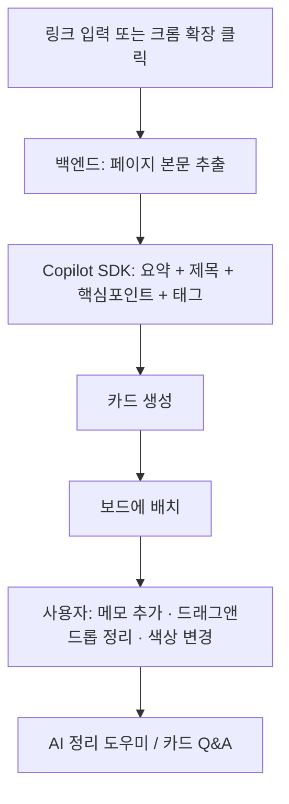
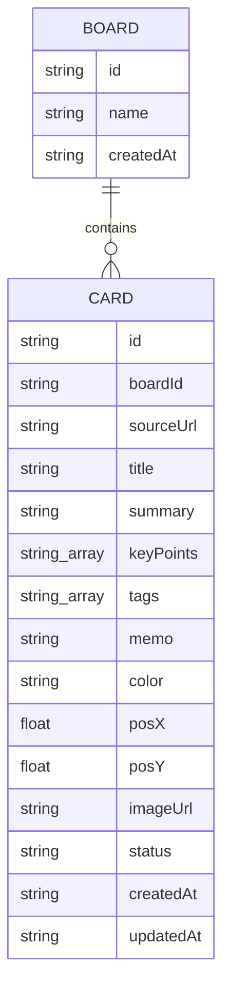
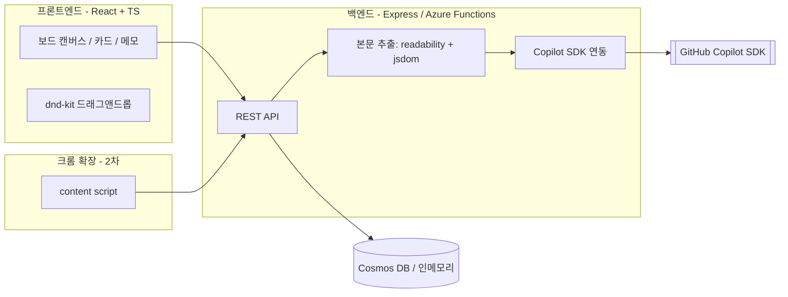
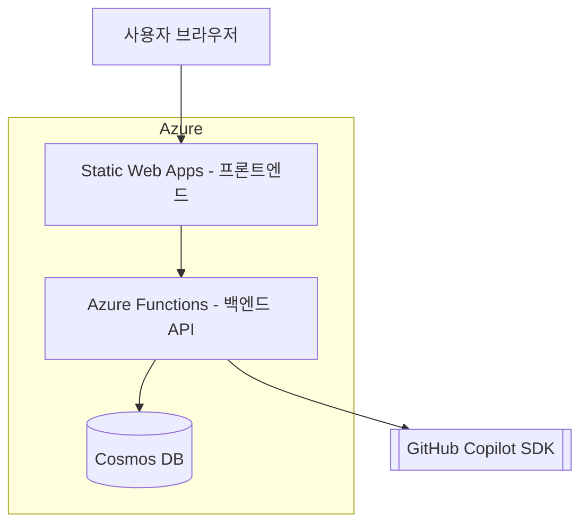

# Curio — AI 웹 큐레이션 보드

> 흩어진 웹 정보를 **카드**로 모아 나만의 지식 **보드**로 정리하는 개인 생산성 웹 앱

링크를 입력하거나 크롬 확장프로그램을 클릭하면, GitHub Copilot SDK가 해당 페이지를 **요약한 카드**로 만들어 줍니다. 사용자는 카드에 자유롭게 **메모를 추가**하고 **드래그앤드롭으로 배치·꾸미며** 자기만의 지식 보드를 완성합니다.

---

## 1. 문제 정의 & 해결

| 구분 | 내용 |
|------|------|
| **문제** | 매일 수많은 웹페이지·아티클을 읽지만, 나중에 다시 찾거나 정리하기 어렵다. 북마크는 쌓이기만 하고 죽은 링크가 된다. |
| **기존 한계** | 북마크는 요약이 없어 다시 열어봐야 하고, 노트 앱은 직접 옮겨 적어야 한다. |
| **해결** | 링크 한 번으로 **AI가 핵심을 요약한 카드** 생성 → 시각적 보드에서 **드래그앤드롭**으로 정리 → 메모로 내 생각 덧붙이기. |
| **한 줄 가치** | "읽은 것을 버리지 않고, 나만의 지식으로 만든다." |

---

## 1-A. 기존 북마크와의 차별점

| 항목 | 기존 북마크 | Curio |
|------|-------------|-------|
| 저장되는 것 | **링크(주소)만** | 링크 + **AI 요약·핵심포인트** |
| 다시 볼 때 | 페이지를 **다시 열어야** 기억 | **카드만 봐도** 내용 회상 |
| 정리 방식 | 폴더 트리(계층) | **자유 배치 보드**(드래그앤드롭) |
| 내 생각 | 못 남김 | 카드마다 **메모 추가** |
| 페이지가 사라지면 | **정보 소실**(죽은 링크) | 요약이 남아 **가치 보존** |
| 분류/검색 | 수동 | **AI 태그·그룹핑·Q&A** |

**진짜 차별점 3가지**

1. **"포인터"가 아니라 "지식"** — 북마크는 *주소*를 저장하지만, Curio는 *요약 + 내 메모*를 저장해 다시 열 필요가 없다. 북마크의 고질병(쌓이기만 하고 안 봄)을 정면 해결.
2. **읽기 → 생각 → 연결이 한 흐름** — 저장에서 끝나지 않고, 요약 확인 → 메모 작성 → AI 그룹핑으로 **능동적 정리**까지 이어짐.
3. **공간적·시각적 큐레이션** — 폴더가 아닌 캔버스. 카드를 펼쳐 배치하며 생각이 정리됨(무드보드/리서치 보드 경험).

> 부분적으로 겹치는 도구(Raindrop·Pocket·Readwise·Heptabase)는 있으나, **"AI 요약 + 자유 보드 + 내 메모"를 하나의 흐름으로 묶고 그 엔진이 Copilot SDK** 라는 점이 핵심 차별점.
>
> 한 문장: **"북마크가 못 하는 건 저장한 걸 다시 안 본다는 것 — Curio는 안 열어봐도 기억나게 만든다."**

---

## 2. 타겟 사용자 & 시나리오

- **대상**: 리서치하는 학생·직장인, 콘텐츠 기획자, 개발자, 정보 수집이 많은 누구나
- **시나리오**
  1. 아티클을 읽다가 링크를 Curio에 붙여넣는다 → 3초 만에 요약 카드 생성
  2. 카드를 주제별 보드(예: "이번 발표 자료", "공부할 것")로 드래그
  3. 카드에 "이 부분 인용하기" 같은 메모를 남긴다
  4. 나중에 보드를 열어 요약·메모만 훑어보며 빠르게 회상한다

---

## 3. 핵심 기능

### MVP (1차 — 웹 앱)
| 기능 | 설명 | Copilot SDK |
|------|------|:----------:|
| **링크 → 카드 생성** | URL 입력 시 페이지 본문 추출 후 요약 카드 생성 | ✅ 요약·제목·핵심포인트 |
| **AI 요약 카드** | 제목·1줄 요약·핵심 포인트 3~5개·추천 태그 자동 생성 | ✅ |
| **대표 이미지** | 페이지 og:image/twitter:image 썸네일 자동 표시 | — |
| **비주얼 보드** | 카드를 드래그앤드롭으로 자유 배치, 색상 변경 | — |
| **메모** | 각 카드에 자유 메모 추가 | — |
| **태그 / 필터** | AI 태그 + 사용자 태그로 검색·필터 | ✅ 태그 추천 |
| **보드 관리** | 여러 보드 생성·전환 (예: 주제별) | — |
| **AI 정리 도우미** | "이 카드들 어떻게 분류할까?" → 그룹핑 제안 | ✅ |
| **카드 Q&A** | 특정 카드/보드 내용에 대해 질문 | ✅ |

### 확장 (2차 이후)
| 기능 | 설명 |
|------|------|
| **크롬 확장프로그램** | 현재 보고 있는 페이지를 클릭 한 번으로 카드화 (드래그한 텍스트 포함) |
| **할 일 연동** | 카드를 "읽을 것/할 일"로 전환 |
| **공유 보드** | 보드를 링크로 공유 |
| **카드 크기 변경** | 카드 너비/높이 리사이즈(핸들). MVP는 색상·위치만 편집 |

---

## 4. 사용자 흐름



---

## 5. 화면 구성 (UI)

```
┌──────────────────────────────────────────────────────────┐
│  Curio        [ 링크 붙여넣기 ____________ ] [+ 카드 만들기]│
├───────────┬──────────────────────────────────────────────┤
│ 보드 목록  │   보드 캔버스 (드래그앤드롭 영역)              │
│ • 전체     │   ┌─────────┐  ┌─────────┐                  │
│ • 발표자료 │   │ 카드 A   │  │ 카드 B   │                  │
│ • 공부     │   │ 요약…    │  │ 요약…    │                  │
│ • 영감     │   │ #태그    │  │ 메모📝   │                  │
│           │   └─────────┘  └─────────┘                  │
│ [AI 도우미]│   ┌─────────┐                                │
│           │   │ 카드 C   │   (자유 배치)                  │
└───────────┴──────────────────────────────────────────────┘
```

- **상단 바**: 링크 입력 → 즉시 카드 생성. 로딩 중에는 스켈레톤 카드 표시.
- **좌측 사이드바**: 보드 전환, AI 정리 도우미 패널 토글.
- **메인 캔버스**: 카드 드래그앤드롭(`@dnd-kit`), 카드 클릭 시 상세(요약·핵심포인트·메모·원문 링크).
- **카드 구성**: 제목 / 1줄 요약 / 핵심 포인트 / 태그 / 사용자 메모 / 원문 링크 / 색상.

---

## 6. 데이터 모델



- **Card**: AI가 채우는 필드(title·summary·keyPoints·tags)와 사용자가 채우는 필드(memo·color·위치)를 분리.
- **`status`** 값: `ready`(정상) · `summarizing`(요약 진행 중) · `error`(요약 실패). 로딩 중 스켈레톤 카드 표시에 사용.
- **`imageUrl`** 은 페이지 대표 이미지(`og:image`→`twitter:image`→`image_src`). 없으면 `null`.
- 카드 **크기(width/height)는 MVP 범위 외**(2차). MVP는 색상·위치만 사용자 편집.
- **Board**: 카드의 묶음. 기본 보드 "전체" 제공.
- MVP는 **인메모리 스토어**, 프로덕션은 **Azure Cosmos DB** 로 교체.

---

## 7. 시스템 아키텍처



---

## 8. API 설계

| 메서드 | 경로 | 설명 |
|--------|------|------|
| `POST` | `/api/cards/from-url` | `{ url, boardId? }` → 본문 추출 + AI 요약 → 카드 생성 |
| `GET` | `/api/cards?boardId=` | 카드 목록 조회 |
| `PATCH` | `/api/cards/:id` | 메모·위치·색상·태그 수정 |
| `DELETE` | `/api/cards/:id` | 카드 삭제 |
| `GET` | `/api/boards` | 보드 목록 |
| `POST` | `/api/boards` | 보드 생성 |
| `POST` | `/api/boards/:id/organize` | AI 정리 도우미: 카드 그룹핑 제안 |
| `POST` | `/api/chat` | 카드/보드에 대한 Q&A |
| `GET` | `/api/health` | 상태 + Copilot 모드(live/demo) |

---

## 9. Copilot SDK 활용 상세

`@github/copilot-sdk` 기반 **세션 오케스트레이션**으로 구현합니다. 단발 프롬프트가 아니라 세션(`createSession`) + **도구 호출(함수 호출)** + **SSE 스트리밍** 을 사용하며, provider 는 Azure OpenAI/Foundry(관리 ID 베어러 토큰, BYOM) 또는 GitHub 기본을 자동 선택합니다. 토큰·엔드포인트 미설정 시 **데모 폴백**으로 앱이 그대로 동작합니다(심사 환경 안정성).

| 사용처 | 오케스트레이션 | 출력 |
|--------|----------------|------|
| 페이지 요약 | 세션 + 구조화 JSON 파싱 | `{ title, summary, keyPoints[], tags[] }` |
| 정리 도우미 | 세션 + 카드 컨텍스트 그룹핑 | 그룹·라벨 제안 |
| 카드 Q&A | 세션 + `search_cards` 도구(함수 호출) + SSE 스트리밍 | 토큰 단위 자연어 답변 |

---

## 10. 기술 스택

| 구분 | 기술 |
|------|------|
| Frontend | React + TypeScript + Vite, `@dnd-kit` (드래그앤드롭) |
| Backend | Node.js + Express (또는 Azure Functions) |
| 본문 추출 | `@mozilla/readability` + `jsdom` |
| AI | GitHub Copilot SDK (`@github/copilot-sdk`) — 세션·도구·스트리밍 |
| 데이터 | 인메모리(MVP) → Azure Cosmos DB |
| 배포 | Azure Static Web Apps + Azure Functions/App Service |
| 확장(2차) | Chrome Extension (Manifest V3) |

---

## 11. Azure 배포 아키텍처



- **Static Web Apps**: React 빌드 산출물 호스팅 + 백엔드 API 연결
- **Azure Functions**: REST API 서버리스 실행 (요약·추출·정리)
- **Cosmos DB**: 카드·보드 영구 저장
- **azd(`azure.yaml`)** 로 `azd up` 한 번에 프로비저닝·배포

---

## 12. 보안 / 개인정보

- Copilot 토큰 등 비밀값은 환경변수(Key Vault) 로 관리, 코드에 포함하지 않음
- 외부 URL fetch 시 SSRF 방지(사설 IP 차단), 본문 크기 제한
- (확장 단계) 사용자별 보드 격리 — Entra ID / GitHub OAuth

---

## 13. 개발 로드맵

| 단계 | 산출물 |
|------|--------|
| **0. 설계** | 본 문서 ✅ |
| **1. 스캐폴드** | 프론트/백엔드 프로젝트 구조, 헬스 체크 |
| **2. 핵심 백엔드** | 본문 추출 + Copilot 요약 → 카드 생성 API |
| **3. 핵심 프론트** | 링크 입력 → 카드 표시, 드래그앤드롭 보드, 메모 |
| **4. AI 부가기능** | 정리 도우미, 카드 Q&A |
| **5. Azure 배포** | `azd up` 으로 클라우드 배포 |
| **6. 크롬 확장** | 현재 페이지 클릭 → 카드화 (선택) |

---

## 14. AI 심사위원 7명 대응

| 심사 항목 | Curio 의 강점 |
|-----------|---------------|
| 기술 완성도 | 본문 추출 + Copilot SDK + Azure 풀스택 |
| 사용자 경험 | 드래그앤드롭 비주얼 보드, 3초 카드 생성 |
| AI 활용도 | 요약·태그·정리·Q&A 등 LLM 핵심 활용 |
| 코드 품질 | TS strict, 모듈 분리, 데모 폴백 |
| 확장성 | 카드→할일/공유/확장프로그램으로 발전 |
| 혁신성 | "북마크의 죽음" 해결, 클리퍼+캔버스 결합 |
| 실용성 | 누구나 매일 겪는 정보 정리 문제 해결 |

---

## 15. 향후 확장

- 크롬 확장프로그램으로 **드래그한 텍스트만 카드화**
- 카드 간 **연관성 자동 연결**(지식 그래프)
- **공유 보드 / 협업**
- **음성 입력**으로 메모 추가(접근성)

---

> 본 문서는 Curio 의 설계 기준 문서입니다. 구현은 13장 로드맵 순서를 따릅니다.

